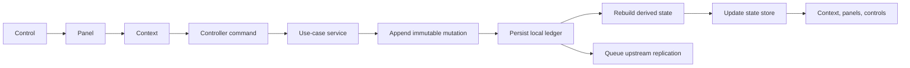
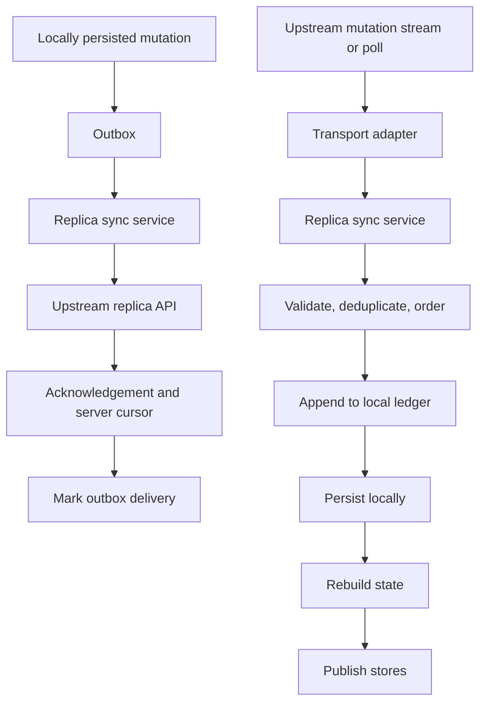
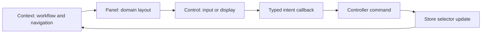

# RaceSweet architecture

RaceSweet is an offline-capable event timing and results application. Its architecture separates business decisions, durable mutation history, derived state, synchronization, and UI rendering so that the same event can be edited locally, replicated upstream, and received from another replica without changing the fundamental processing rules.

`CONTEXT.md` is the authoritative glossary for the business terms used here.

## Architectural rules

1. Business and timing state changes are commands processed outside React. A UI component may request a change, but it must not apply business rules, mutate a domain object, write a file, or call a remote API itself.
2. Durable event data is an immutable ledger. A correction is a new mutation; existing mutations are never edited or removed as part of normal operation.
3. Derived state is rebuilt from accepted mutations. Stores publish that derived state to the UI and do not become a second persistence model.
4. Local durability completes before an upstream push is considered. A failed remote push leaves a locally durable mutation available for retry.
5. Remote mutations use the same validation, deduplication, ledger, and state rebuild path as local mutations. They are not applied directly to a store.
6. Processing services operate on models and records, never React components. UI code renders projections and sends typed commands only.

## DURT FileMaker data source

RaceSweet uses the bundled `fmp2json.exe` utility to extract tables from DURT FileMaker `.fp7` files. Build the Windows x64 utility with Docker:

```powershell
npm run build:fmptools:win32
```

The executable is written to `packages\fmptools-win32-x64\bin\fmp2json.exe` beneath the repository root. In the DURT data source panel, this is the path to select when supplying an advanced extractor override. The default configuration uses this bundled executable automatically; packaged Electron builds copy it to the application resources directory.

## Source layout and ownership

| Location | Owns | Must not own |
| --- | --- | --- |
| `src/model` | Business types, identifiers, invariants, and pure domain helpers. | UI, file I/O, HTTP, Electron, or React state. |
| `src/ledger` | Mutation types, validation, ordering, replay, and pure reducers that derive catalog state. | UI callbacks, remote transport, or filesystem access. |
| `src/service` | Use-case services that validate commands, coordinate domain logic, append mutations, and request persistence. | React components or direct widget state. |
| `src/controllers` | Application command and event adapters. They translate UI or transport requests into service calls and publish outcomes to stores. | Domain rules duplicated from services. |
| `src/state` | Read-only UI projections, selection state, loading state, and subscriptions to service outcomes. | Durable data, mutation construction, processing logic, or transport calls. |
| `src/persistence` | Local storage adapters, file layouts, serialization, migrations, and atomic write concerns. | Business decisions or UI concerns. |
| `src/app` | Electron composition root, IPC boundary, startup, dependency wiring, and platform security. | Domain processing rules or reusable UI panels. |
| `src/parsers` | Conversion of external files and timing feeds into validated normalized data. | Persistence decisions or UI rendering. |
| `src/catalog` | Source-specific catalog import and source-application logic. | React state and generic timing calculations. |
| `src/views/context` | Top-level context composition and context-specific navigation. | Reusable panel implementation or business mutations. |
| `src/views/panels` | Reusable, domain-focused layouts composed from controls. | Event lifecycle orchestration or persistence. |
| `src/controls` | Small reusable input, display, and interaction controls. | Knowledge of a particular event, session, service, or store. |
| `src/views` | Shared presentation, display, report, and styling components. | Ledger writes and processing logic. |
| `src/utils` | Small shared technical helpers used by multiple layers. | Layer-specific business workflows. |

The existing `App` component is the current composition point. New work should move long-lived UI state into `src/state` and command wiring into `src/controllers` rather than extending `App` with more business callbacks.

## Core state model

The event catalog ledger is the durable source of truth for event metadata, sessions, categories, entrants, entries, imports, and activation state. The catalog reducer rebuilds `EventCatalogState` from that ledger after every accepted mutation.

Runtime timing state contains crossings, flags, records, timing calculations, and session projections. It is scoped to an event and session and must retain a clear link to the catalog entities it uses. Catalog metadata and runtime timing state are related but are not interchangeable.

Each store has one narrow purpose:

| Store | Publishes | May contain | Must not contain |
| --- | --- | --- | --- |
| `eventCatalogStore` | Derived event, session, category, entrant, and entry data. | Active selections and selector helpers. | Ledger writes or API calls. |
| `timingStore` | Active timing session, normalized records, and calculated results. | Display filters and live processing status. | Decoder protocol logic or persistence. |
| `systemConfigStore` | Source configuration and user-level selections. | UI-only configuration state. | Event mutations. |
| `syncStore` | Connectivity, pending mutation count, last sync, and errors. | Retry and conflict presentation state. | Remote mutation application logic. |
| `uiStore` | Dialog, panel, focus, and transient interaction state. | Ephemeral presentation data. | Domain data copied from another store. |

Stores expose selectors and subscriptions. They are updated by controller or application outcomes, never by controls mutating an object they received in props. A store may derive a view model from multiple read-only sources, but it must not cache a competing editable copy of catalog or timing data.

## Local command flow

Every local change follows this order. The UI may show pending status while the operation runs, but it does not optimistically invent a durable state.



The controller owns request validation at the application boundary, error mapping, and store publication. The service owns business validation and the mutation definition. The ledger owns replay validation and state derivation. The persistence adapter owns files. The replication adapter owns network transport. No layer may skip one of its predecessors to update the UI faster.

For catalog data, `EventCatalogService` is the initial service boundary. It already appends mutations, rebuilds state with `applyEventCatalogLedger`, saves through `EventCatalogPersistence`, and provides an `onPersistedLedger` hook. Future controller and sync work should wrap this behaviour rather than create a second catalog mutation path.

Race admin changes use `RaceAdminService`; system source configuration uses `SystemConfigService`. They must remain separate from catalog mutations unless the data is explicitly event or session metadata. The persistence policy in `AGENTS.md` decides which service owns an ambiguous field.

## Replication and remote events

Replication is a pluggable application concern. Introduce a `ReplicaSyncService` or equivalent adapter behind a small transport interface rather than embedding HTTP or websocket calls in a controller, store, or UI component.



The required replication behaviour is:

1. Each mutation has a stable mutation ID, timestamp, author or replica identity when available, and schema version.
2. A local mutation is saved locally before it is placed in the outbound queue. The queue records acknowledgement state separately from the immutable ledger.
3. A retry reuses the original mutation ID. Upstream endpoints must be idempotent for that ID.
4. An incoming mutation is schema-validated, deduplicated by ID, ordered under the ledger policy, then persisted and reduced exactly as a local mutation is.
5. Incoming mutations are not re-enqueued as new local changes. Their origin and acknowledgement cursor prevent replication loops.
6. Conflicts are represented as resolvable domain outcomes or additional mutations, never as one replica silently overwriting another's history.
7. Transport failure changes `syncStore` status and retains the outbox. It does not roll back a locally durable accepted mutation.

The upstream replica endpoint should accept and return mutation envelopes, not full mutable state snapshots. A snapshot may accelerate initial sync, but it must be verifiable against a cursor and followed by the mutation stream.

## Local file layout

Local storage persists ledger data through adapters in `src/persistence` and crosses the Electron boundary through `src/app` IPC APIs. Renderer code must not write directly to Node or browser filesystem APIs.

The catalog persistence format is split for manageable event files:

| File type | Contents | Ownership |
| --- | --- | --- |
| Catalog manifest | Schema version, global mutations, event file references, track-map references, and mutation order. | `EventCatalogPersistence` |
| Per-event ledger file | Mutations belonging to one event. | `EventCatalogPersistence` |
| Per-event track-map file | Track-map-specific event mutations where stored separately. | `EventCatalogPersistence` |
| Race admin data | Session-scoped administrative changes. | `RaceAdminPersistence` |
| System configuration | Data source configuration and persisted UI selection. | `SystemConfigPersistence` |
| Source cache or raw import file | Original source material retained for reload or audit where configured. | Source adapter or import service |

Writes must be atomic at the adapter boundary and report actionable failures to the application error state. A read reassembles the manifest and related files into one ledger before the reducer runs. A remote acknowledgement never permits local data to be discarded unless a separate, explicit retention policy does so.

## UI composition

A context is a top-level workflow surface, not a reusable widget. It receives only the selectors, command callbacks, and navigation state required to compose its panels. Contexts do not contain the business implementation of a command.

Panels are reusable domain layouts. For example, `EntrantDetailsPanel`, a session list, and a data source panel may appear in more than one context. A panel receives a typed view model and typed callbacks; it does not obtain a service singleton or reach into another context's local state.

Controls are the smallest reusable pieces: fields, selectors, buttons, table cells, and display primitives. A control owns input mechanics and accessibility only. It reports intent through callbacks and has no event, session, or service knowledge unless that concept is intrinsic to the control itself.



The main contexts follow the lifecycle below. A context may share panels and controls with another context, but ownership remains with the reusable file, not the first context that used it.

| Lifecycle stage | Contexts | Primary responsibility |
| --- | --- | --- |
| Event inception | Events, Sessions, Categories | Create the event scope, schedule sessions, define track and competition rules. |
| Pre-event entry | Entrants, Categories, System | Manage entrants, teams, entries, identifiers, starts, and assigned sources. |
| Live collection | Timing | Configure inputs, normalize decoder records, show acquisition health, and direct records into timing processing. |
| Live and post-event processing | Results, Reports, Timing | Project results, resolve permitted corrections, calculate standings, and render reports such as lap charts. |

The timing context may show live information but must not contain decoder or result-calculation code. It invokes timing ingestion or processing services and renders their state through `timingStore` selectors.

## Processing boundaries

Processing changes state only through named services with explicit input and output types. Typical responsibilities are:

| Service type | Input | Output |
| --- | --- | --- |
| Ingestion service | Raw device packet, file row, or external API payload. | Normalized crossing, flag, or import candidate. |
| Matching service | Normalized record and catalog identifiers. | Matched participant or a reviewed unmatched record. |
| Timing processing service | Validated records, session configuration, and prior runtime state. | Calculated laps, sectors, speed traps, positions, and result projections. |
| Catalog service | Event administration command or imported scaffolding. | One or more catalog ledger mutations and rebuilt catalog state. |
| Sync service | Mutation envelope or acknowledgement. | Persisted replication status and accepted local mutations. |
| Report service | Read-only projections and report options. | Render-ready report data, including lap chart rows. |

Pure calculations belong close to their model or dedicated processing module and must be independently testable without React, Electron, a filesystem, or a network connection. Services coordinate these calculations and persistence; they do not depend on views. Views receive state updates after the service outcome.

## Implementation checklist

When adding a feature, identify the command, service owner, mutation or local storage policy, derived store selector, context, panel, and controls before writing UI code. Add tests that prove the UI action invokes the service, persists the required data, rebuilds the affected state, and requests the configured upstream replication callback where applicable.

For a remote feature, additionally test retry after an unavailable endpoint, duplicate delivery, receiving a mutation created by another replica, and the absence of a replication loop. For a timing feature, test parsing and processing separately from its context or panel.
